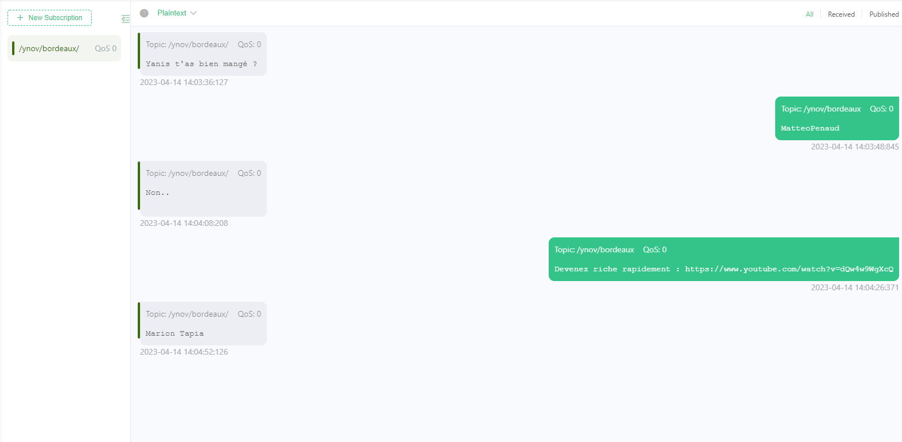

# How to use
First thing first, install paho-cpp library from here : https://github.com/eclipse/paho.mqtt.cpp

Then, download this repo (make sure you have cmake installed).

Open the folder in VSCode and build with the cmake extension.

The build should give you 2 executables :
- The subscriber, which will read messages from the broker;
- The publisher, which will send a message to the same broker.

Make sure you run the SUBSCRIBER first, then the publisher in an other terminal.

# Screens
Screen from MQTTx :

